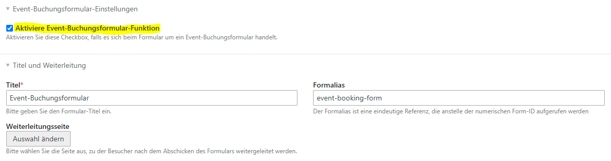
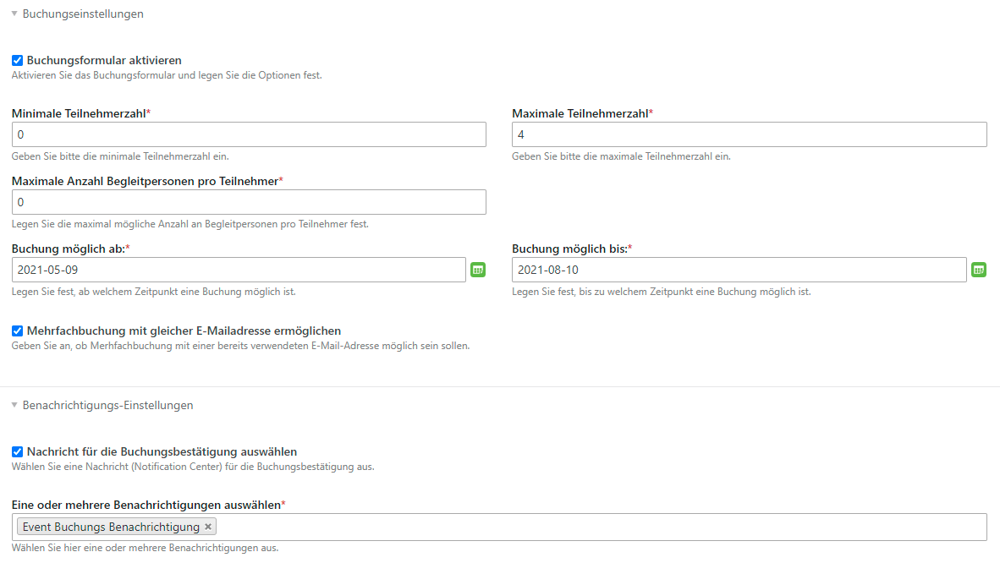

# Events buchen mit Contao
### Achtung: Bei der Migration von Version 3.x nach 4.x gab es mehrere Änderungen in der Benennung der Modul-Typen und Template-Namen. Dies bitte bei einer allfälligen Migration berücksichtigen.

## Events buchen
Mit dieser Erweiterung für Contao CMS werden Events über ein Anmeldeformular buchbar. Verschiedene Buchungsstati stehen zur Verfügung.
Falls Events bereits ausgebucht sind, existiert **ab Version 6.0** die Möglichkeit, dass sich interessierte Besucher auf die **Warteliste** setzen lassen können.
Das Anmeldeformular kann im Contao Formulargenerator erstellt werden.
Die Erweiterung stellt während des Installationsprozesses ein Sample Anmeldeformular bereit, welches Grundansprüchen genügen sollte.
Die Werte des Formulars werden in der Datenbank in tl_calendar_events_member abgelegt
und sind im Backend einsehbar und über eine CSV-Datei exportierbar.

## Benachrichtigung
Event-Organisator und Teilnehmer können bei Event-Buchungen und Event-Stornierungen über das Notification Center benachrichtigt werden.

## Frontend Module
#### Event Anmeldeformular
Mit einem Frontend Modul lässt sich auf einer Event-Reader Seite ein Event-Anmeldeformular einblenden.
Verlinken Sie in den Moduleinstellungen mit dem entsprechenden Formular aus dem Contao Formulargenerator.
Wichtig! Das Anmeldeformular zieht den Eventnamen aus der Url.
Der Event-Alias oder die Event-Id müssen deshalb zwingend als Parameter in der Url enthalten sein.
Das Anmeldeformular sollte deshalb idealerweise immer in Kombination mit dem Event-Reader-Modul eingebunden werden.

#### Angemeldete Mitglieder im Frontend auflisten
Mit einem weiteren Frontend Modul können zu einem Event bereits angemeldete Personen aufgelistet werden.
Wichtig! Das Auflistungsmodul zieht den Eventnamen aus der Url.
Der Event-Alias oder die Event-Id müssen deshalb zwingend als Parameter in der Url enthalten sein.
Das Mitgliederauflistungs-Modul sollte deshalb idealerweise immer in Kombination mit dem Event-Reader-Modul eingebunden werden.

#### Von Event abmelden
Die Erweiterung stellt auch eine Möglichkeit sich von einem Event wieder abzumelden.
Via Notification Center kann dem Teilnehmer ein Abmeldelink (##event_unsubscribeHref##) zugeschickt werden.
Erstellen Sie das entsprechende Modul und binden Sie es auf einer neuen Seite in der Seitenstruktur ein.
Diese Seite sollten Sie sinnvollerweise in der Navigation nicht anzeigen lassen.
In der Kalendereinstellung legen Sie anschliessend fest, auf welcher Seite das Event-Abmeldeformular liegt.

## Einrichtung (Ablauf)
1. Kalender und Events anlegen.
2. "Eventliste" und "Eventleser" Frontend-Module anlegen.
3. Falls nicht schon geschehen, E-Mail-Gateway (Notification Center) anlegen.
4. Benachrichtigung des Typs "Event-Buchungsbestätigung" anlegen (Notification Center)
5. Im Contao Formulargenerator die benötigten Felder bereitstellen.
6. Im Formular (Formulargenerator) die Weiterleitungsseite einrichten.
7. Das Frontend Modul "Event-Buchungsformular" erstellen und in den Modul-Einstellungen das bei Punkt 5 erstellte Formular auswählen. Danach noch die bei Punkt 4 erstellte Benachrichtigung auswählen.
8. Die 3 erstellten Module (Eventliste, Eventleser und Event-Buchungsformular) in der Contao Seitenstruktur einbinden (Wichtig! Event-Buchungsformular und Eventleser gehören auf die gleiche Seite).
9. Optional das Frontend Modul "Event-Abmeldeformular" mit dazugehörender Benachrichtigung "Event-Abmeldung" erstellen und dieses in einer extra dafür erstellten Seite einbinden.
10. Optional das Frontend Modul "Event-Mitglieder-Auflistung" erstellen und auf der Seite mit dem Eventleser Modul einbinden.
11. Bei den Events die Buchungs-, Benachrichtigungs- und Abmeldeoptionen konfigurieren.
12. In der Kalendereinstellung die Seite mit dem "Event-Abmeldeformular" festlegen.

#### Punkt 4: E-Mail Benachrichtigung im Notification Center konfigurieren
Versenden Sie beim Absenden des Formulars eine oder mehrere Nachrichten an den Teilnehmer oder eine Kopie an den Eventorganisator
und nutzen Sie dabei die **Simple Tokens**.

Mit ##event_unsubscribeHref## kann ein tokengesicherter Event-Abmeldelink mitgesandt werden. Dazu muss aber im Event die Event-Abmeldung erlaubt werden.
Auch sollte das dafür nötige Frontend Modul "Event-Abmeldeformular" erstellt und in einer Seite eingebunden worden sein.

##### Gebrauch der Simple Tokens im Notification Center
Teilnehmer:  ##member_gender## (Männlich, Weiblich oder Divers), ##member_salutation## (Übersetzt: Herr oder Frau), ##member_email##, ##member_firstname##, ##member_street##, etc. (Feldnamen aus tl_calendar_events_member)

Event: ##event_title##, ##event_street##, ##event_postal##, ##event_city##, ##event_unsubscribeLimitTstamp##, etc. (Feldnamen aus tl_calendar_events)

Email-Absender: ##sender_name##, ##sender_email, etc. (Feldnamen aus tl_user)

#### Beispieltext Notification Center
```
{if member_gender=='Männlich'}
Sehr geehrter Herr ##member_firstname## ##member_lastname##
{elseif member_gender=='Weiblich'}
Sehr geehrte Frau ##member_firstname## ##member_lastname##
{else}
Hallo ##member_firstname## ##member_lastname##
{endif}

Hiermit bestätigen wir den Eingang Ihre Buchungsanfrage zur Veranstaltung "##event_title##" vom ##event_startDate##.

Buchungsstatus: ##member_bookingState##.

Bitte beachten Sie, dass Ihre Teilnahme erst nach erfolgter Prüfung definitiv wird. Sie erhalten dazu in den nächsten 1-2 Werktagen von uns die definitive Buchungsbestätigung.

Ihre Angaben:
Name/Vorname: ##member_firstname## ##member_lastname##
Adresse: ##member_street##, ##member_postal##, ##member_city##
Telefon: ##member_phone##
E-Mail: ##member_email##
Begleitpersonen: ##member_escorts##

{if event_activateDeregistration=='1'}
Bitte benutzen Sie folgenden Link, um sich wieder von der Veranstaltung abzumelden:
##member_unsubscribeHref##
{endif}

Freundliche Grüsse

##sender_name##
```
#### Überblick über alle Simple Tokens beim Gebrauch des Notification Centers
```
Array
(
    [admin_email] => admin@mi6.com
    [member_id] => 26
    [member_pid] => Testevent 2
    [member_tstamp] => 08.09.2021 21:26
    [member_eventState] => waiting_list
    [member_dateAdded] => 08.09.2021 21:26
    [member_notes] => Tomorrow never dies!
    [member_salutation] => Herr
    [member_firstname] => James
    [member_lastname] => Bond
    [member_gender] => Männlich
    [member_dateOfBirth] => 12. März 1976
    [member_street] => Casino Royale
    [member_postal] => 66666
    [member_city] => London
    [member_phone] => 23123
    [member_email] => 007@mi6.com
    [member_escorts] => 0
    [member_bookingToken] => d47636dd-7606-4f0b-ad8d-82461abde483
    [event_id] => 3
    [event_pid] => Events
    [event_tstamp] => 08.09.2021 14:04
    [event_title] => Testevent 2
    [event_alias] => testevent-2
    [event_author] => Eve Moneypenny
    [event_addTime] => nein
    [event_startTime] => 00:00
    [event_endTime] => 23:59
    [event_startDate] => 16. September 2021
    [event_endDate] => 8. September 2021
    [event_location] => London
    [event_teaser] => Casino Royal
    [event_activateDeregistration] => ja
    [event_eventBookingNotificationSender] => Eve Moneypenny
    [event_eventBookingNotification] => Event Buchungs Benachrichtigung
    [event_activateBookingNotification] => ja
    [event_maxEscortsPerMember] => 0
    [event_maxMembers] => 11
    [event_bookingStartDate] => 7. Juni 2021
    [event_bookingEndDate] => 15. September 2021
    [event_activateBookingForm] => ja
    [event_city] => Nothingham
    [event_postal] => 6666
    [event_street] => black corner 2
    [event_allowDuplicateEmail] => ja
    [event_unsubscribeLimitTstamp] => 12.08.2021 16:40
    [event_minMembers] => 0
    [event_addEscortsToTotal] => nein
    [sender_id] => 1
    [sender_username] => eve.moneypenny
    [sender_name] => Eve Moneypenny
    [sender_email] => em@mi6.com
    [sender_language] => de,
    // etc.
)

```

#### Punkt 5: Event-Buchungsformular erstellen
Beim ersten Aufruf der Seite nach der Installation der Erweiterung wird **automatisch** ein Beispielformular mit allen benötigten Feldern generiert.
**Wichtig!!! Im Formular muss die Checkbox "Aktiviere Event-Buchungsformular-Funktion" aktiviert sein.** Weitere Einstellungen müssen keine zwingend gemacht werden.

Folgende Felder können im Formular erstellt werden:
firstname,lastname,gender,dateOfBirth,street,postal,city,phone,email,escorts,notes


Werden weitere Felder gewünscht, so müssen diese im Projekt-ROOT unter `contao/dca/tl_calendar_events_member.php` definiert werden.
Danach Cache neu aufbauen und via Installtool die Felder in der Datenbank anlegen.

### Beispieltext Notification Center
```
{if member_gender=='Männlich'}
Sehr geehrter Herr ##member_firstname## ##member_lastname##
{elseif member_gender=='Weiblich'}
Sehr geehrte Frau ##member_firstname## ##member_lastname##
{else}
Hallo ##member_firstname## ##member_lastname##
{endif}

Hiermit bestätigen wir den Eingang Ihre Buchungsanfrage zur Veranstaltung "##event_title##" vom ##event_startDate##.

Buchungsstatus: ##member_bookingState##.

Bitte beachten Sie, dass Ihre Teilnahme erst nach erfolgter Prüfung definitiv wird. Sie erhalten dazu in den nächsten 1-2 Werktagen von uns die definitive Buchungsbestätigung.

Ihre Angaben:
Name/Vorname: ##member_firstname## ##member_lastname##
Adresse: ##member_street##, ##member_postal##, ##member_city##
Telefon: ##member_phone##
E-Mail: ##member_email##
Begleitpersonen: ##member_escorts##

Bitte benutzen Sie folgenden Link, um sich wieder von der Veranstaltung abzumelden:
##member_unsubscribeHref##

Freundliche Grüsse

##sender_name##
```
### Überblick über alle Simple Tokens beim Gebrauch des Notification Centers
```
Array
(
    [admin_email] => admin@mi6.com
    [member_id] => 26
    [member_pid] => Testevent 2
    [member_tstamp] => 08.09.2021 21:26
    [member_eventState] => waiting_list
    [member_dateAdded] => 08.09.2021 21:26
    [member_notes] => Tomorrow never dies!
    [member_salutation] => Herr
    [member_firstname] => James
    [member_lastname] => Bond
    [member_gender] => Männlich
    [member_dateOfBirth] => 12. März 1976
    [member_street] => Casino Royale
    [member_postal] => 66666
    [member_city] => London
    [member_phone] => 23123
    [member_email] => 007@mi6.com
    [member_escorts] => 0
    [member_bookingToken] => d47636dd-7606-4f0b-ad8d-82461abde483
    [event_id] => 3
    [event_pid] => Events
    [event_tstamp] => 08.09.2021 14:04
    [event_title] => Testevent 2
    [event_alias] => testevent-2
    [event_author] => Eve Moneypenny
    [event_addTime] => nein
    [event_startTime] => 00:00
    [event_endTime] => 23:59
    [event_startDate] => 16. September 2021
    [event_endDate] => 8. September 2021
    [event_location] =>
    [event_teaser] =>
    [event_activateDeregistration] => ja
    [event_eventBookingNotificationSender] => Eve Moneypenny
    [event_eventBookingNotification] => Event Buchungs Benachrichtigung
    [event_activateBookingNotification] => ja
    [event_maxEscortsPerMember] => 0
    [event_maxMembers] => 11
    [event_bookingStartDate] => 7. Juni 2021
    [event_bookingEndDate] => 15. September 2021
    [event_activateBookingForm] => ja
    [event_city] => Nothingham
    [event_postal] => 6666
    [event_street] => black corner 2
    [event_allowDuplicateEmail] => ja
    [event_unsubscribeLimitTstamp] => 12.08.2021 16:40
    [event_minMembers] => 0
    [event_addEscortsToTotal] => nein
    [sender_id] => 1
    [sender_username] => eve.moneypenny
    [sender_name] => Eve Moneypenny
    [sender_email] => em@mi6.com
    [sender_language] => de
)

```
[Dokumentation](https://docs.contao.org/dev/getting-started/starting-development/#contao-configuration-translations)

```php
<?php
// Put this in TL_ROOT/contao/dca/tl_calendar_events_member.php

use Contao\CoreBundle\DataContainer\PaletteManipulator;

// Add additional field to tl_calendar_events_member
$GLOBALS['TL_DCA']['tl_calendar_events_member']['fields']['foodHabilities'] = [
    'exclude'   => true,
    'search'    => true,
    'sorting'   => true,
    'inputType' => 'select',
    'options'   => ['vegetarian', 'vegan'],
    'eval'      => ['includeBlankOption' => true, 'tl_class' => 'w50'],
    'sql'       => "varchar(255) NOT NULL default ''",
];

// Add a new legend and custom field to the default.
Contao\CoreBundle\DataContainer\PaletteManipulator::create()
    ->addLegend('food_legend', 'personal_legend', PaletteManipulator::POSITION_AFTER)
    ->addField(['foodHabilities'], 'food_legend', PaletteManipulator::POSITION_APPEND)
    ->applyToPalette('default', 'tl_calendar_events_member');

```


#### Punkt 11: E-Mail Buchungsbestätigung im Event aktivieren
Aktivieren Sie beim Event die Buchungsbestätigung mit dem Notification Center, wählen Sie eine Benachrichtigung aus und legen Sie einen Absender mit einer gültigen E-Mail-Adresse (tl_user) fest.


### Template Variablen

Folgende zusätzliche Template Variablen sind in allen Kalender-Templates einsetzbar:

Tag | type | Erklärung
------------ |------------- |--
`event` | array | Enthält alle Event-Daten.
`eventConfig` | object | Enthält das EventConfig-Objekt.
`registrations` | array | Zeigt alle Daten zu den für den Event registierten Personen (das Daten-Array enthält auch die unbestätigten/stornierten Personen)
`canRegister` | bool | Zeigt, ob eine Registrierung möglich ist. Auch auf Warteliste, wenn Event bereits ausgebucht ist.
`isFullyBooked` | bool | Zeigt, ob der Event ausgebucht ist.
`numberFreeSeats` | int | Zeigt, die noch verfügbaren Plätze an.
`numberFreeSeatsWaitingList` | int | Zeigt, die noch verfügbaren Plätze auf der Warteliste an.
`confirmedBookingsCount` | int | Zeigt, die Anzahl bestätigter Registrierungen an.
`bookingMin` | int | Zeigt, die minimal verlangte Teilnehmerzahl an.
`bookingMax` | int | Zeigt, die maximale Teilnehmerzahl an.
`bookingStartTimestamp` | int | Zeigt, die Buchungsstartzeit (timestamp) an.
`bookingStartDate` | string | Zeigt, die Buchungsstartzeit (date) an.
`bookingStartDatim` | string | Zeigt, die Buchungsstartzeit (datim) an.
`bookingEndTimestamp` | int | Zeigt, die Buchungsendzeit (timestamp) an.
`bookingEndDate` | string | Zeigt, die Buchungsendzeit (date) an.
`bookingEndDatim` | string | Zeigt, die Buchungsendzeit (datim) an.
`hasLoggedInUser` | bool | Zeigt an, ob ein Mitglied angemeldet ist.
`loggedInUser` | array | Enthält alle Daten zum eingeloggten FE User.

## Mit Hooks Frontend Module erweitern/anpassen
Vor allem das Modul "Buchungsformular" lässt sich sehr gut erweitern. An verschiedenen Stellen im Code lassen sich via Hooks Funktionalitäten wie Lego-Bausteine hinzufügen oder durch Deaktivierung eines Hooks unerwünschte Funktionalitäten entfernen.
Um sich einen Überblick über die verschiedenen Hooks zu verschaffen, hilft ein Blick in den [Buchungs-Controller](https://github.com/markocupic/calendar-event-booking-bundle/blob/master/src/Controller/FrontendModule/CalendarEventBookingEventBookingModuleController.php).

Folgende **zusätzliche HOOKS** stehen neben den Contao Hooks zusätzlich zur Verfügung:

**HOOK** | **Erklärung**
------------ |--
`calEvtBookingSetCase` | Mit diesem Hook kann auf den Modus (Case) im Buchungsmodul Einfluss genommen werden.
`calEvtBookingAddField` | Mit diesem Hook kann auf die Sichtbarkeit der Buchungs-Formular- Felder Einfluss genommen werden.
`calEvtBookingPrepareFormData` | Mit diesem Hook können die Eingaben im Buchungsformular vor dem Abspeichern in die Datenbank verändert werden. Z.B. Datum in einen Timestamp umwandeln
`calEvtBookingPreBooking` | Dieser Hook wird unmittelbar vor dem Abspeichern der Buchungsdaten getriggert.
`calEvtBookingPostBooking` | Dieser Hook wird unmittelbar nach dem Abspeichern der Buchungsdaten getriggert.
`calEvtBookingPreValidate` | Dieser Hook wird unmittelbar vor dem Überprüfen der Buchungsformular-Feld-Eingaben getriggert.
`calEvtBookingValidateRegistration` | Dieser Hook wird getriggert beim Überprüfen der Buchungsanfrage. (Feststellen, ob noch genügend freie Plätze vorhanden sind.)
`calEvtBookingUnsubscribeFromEvent` | Dieser Hook wird unmittelbar nach der Stornierung einer Buchung durch das MItglied getriggert. Kann u.A. dazu genutzt werden, um Benachrichtigungen zu versenden.
`calEvtBookingStateChange` | Dieser Hook wird getriggert, wenn im Backend der Buchungsstatus geändert wird. Könnte u.A. dazu genutzt werden, um Benutzer über die Änderung ihres Buchungsstatus zu informieren.

```php
<?php
// src/EventListener/DoSomething.php

declare(strict_types=1);

namespace App\EventListener;

use Contao\CoreBundle\ServiceAnnotation\Hook;
use Haste\Form\Form;
use Markocupic\CalendarEventBookingBundle\Controller\FrontendModule\CalendarEventBookingEventBookingModuleController;
use Markocupic\CalendarEventBookingBundle\EventBooking\Config\EventConfig;
use Markocupic\CalendarEventBookingBundle\EventListener\ContaoHooks\AbstractHook;
use Markocupic\CalendarEventBookingBundle\EventListener\ContaoHooks\PostBooking\Notification;
use Markocupic\CalendarEventBookingBundle\Model\CalendarEventsMemberModel;

/**
 * @Hook(DoSomething::HOOK, priority=DoSomething::PRIORITY)
 */
final class DoSomething extends AbstractHook
{
    public const HOOK = 'calEvtBookingPostBooking';
    public const PRIORITY = 9000;

    public function __invoke(Form $form, EventConfig $eventConfig, CalendarEventsMemberModel $eventMember): void
    {
        if (!self::isEnabled()) {
            return;
        }

        // It is possible to disable a built in HOOK with a lower priority
        // The built in notification hook has priority of 1000
        // so we can disable it.
        Notification::disableHook();

        // Create your own notification logic here
        // .......

        // Get the current event
        $objEvent = $eventConfig->getEvent();

        // Do something more
        // .......

    }
}

```
