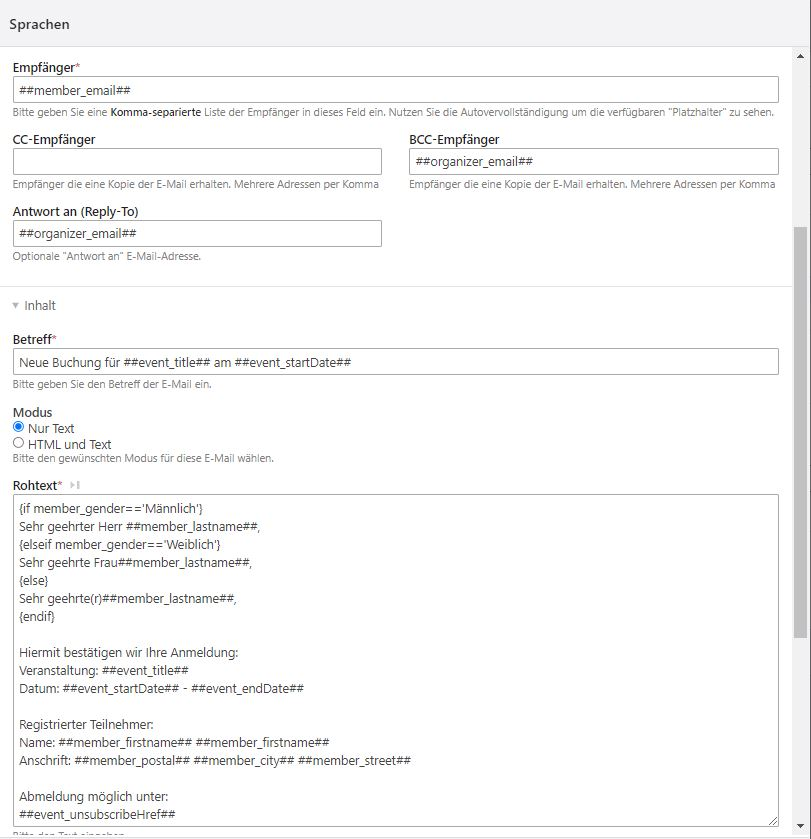

# Events buchen mit Contao
### Achtung: Bei der Migration von Version 3.x nach 4.x gab es mehrere Änderungen in der Benennung der Modul-Typen und Template-Namen. Dies bitte bei einer allfälligen Migration berücksichtigen.

## Events buchen
Mit dieser Contao 4 Erweiterung werden Events über ein Anmeldeformular buchbar.
Das Anmeldeformular kann im Contao Formulargenerator erstellt werden.
Die Erweiterung stellt während des Installationsprozesses ein Sample Anmeldeformular bereit, welches Grundansprüchen genügen sollte.
Die Werte des Formulars werden in der Datenbank in tl_calendar_events_member abgelegt
und sind im Backend einsehbar und über eine CSV-Datei exportierbar.

## Benachrichtigung
Event-Organisator und Teilnehmer können bei Event-Anmeldung und Event-Abmeldung über das Notification Center benachrichtigt werden.

## Frontend Module
#### Event Anmeldeformular
Mit einem Frontend Modul lässt sich auf einer Event-Reader Seite ein Event-Anmeldeformular einblenden.
Verlinken Sie in den Moduleinstellungen mit dem entsprechenden Formular aus dem Contao Formulargenerator.
Wichtig! Das Anmeldeformular zieht den Eventnamen aus der Url.
Der Event-Alias oder die Event-Id müssen deshalb zwingend als Parameter in der Url enthalten sein.
Das Anmeldeformular sollte deshalb idealerweise immer in Kombination mit dem Event-Reader-Modul eingebunden werden.

#### Angemeldete Mitglieder im Frontend auflisten
Mit einem weiteren Frontend Modul können zu einem Event bereits angemeldete Personen aufgelistet werden.
Wichtig! Das Auflistungsmodul zieht den Eventnamen aus der Url.
Der Event-Alias oder die Event-Id müssen deshalb zwingend als Parameter in der Url enthalten sein.
Das Mitgliederauflistungs-Modul sollte deshalb idealerweise immer in Kombination mit dem Event-Reader-Modul eingebunden werden.

#### Von Event abmelden
Die Erweiterung stellt auch eine Möglichkeit sich von einem Event wieder abzumelden.
Via Notification Center kann dem Teilnehmer ein Abmeldelink (##event_unsubscribeHref##) zugeschickt werden.
Erstellen Sie das entsprechende Modul und binden Sie es auf einer neuen Seite in der Seitenstruktur ein.
Diese Seite sollten Sie sinnvollerweise in der Navigation nicht anzeigen lassen.
In der Kalendereinstellung legen Sie anschliessend fest, auf welcher Seite das Event-Abmeldeformular liegt.

## Einrichtung (Ablauf)
1. Kalender und Events anlegen.
2. "Eventliste" und "Eventleser" Frontend-Module anlegen.
3. Falls nicht schon geschehen, E-Mail-Gateway (Notification Center) anlegen.
4. Benachrichtigung des Typs "Event-Buchungsbestätigung" anlegen (Notification Center)
5. Im Contao Formulargenerator die benötigten Felder bereitstellen.
6. Das Frontend Modul "Event-Buchungsformular" erstellen und in den Modul-Einstellungen das bei Punkt 5 erstellte Formular auswählen. Danach noch die bei Punkt 4 erstellte Benachrichtigung auswählen.
7. Die 3 erstellten Module (Eventliste, Eventleser und Event-Buchungsformular) in der Contao Seitenstruktur einbinden (Wichtig! Event-Buchungsformular und Eventleser gehören auf die gleiche Seite).
8. Optional das Frontend Modul "Event-Abmeldeformular" mit dazugehörender Benachrichtigung "Event-Abmeldung" erstellen und dieses in einer extra dafür erstellten Seite einbinden.
9. Optional das Frontend Modul "Event-Mitglieder-Auflistung" erstellen und auf der Seite mit dem Eventleser Modul einbinden.
10. Bei den Events die Buchungs-, Benachrichtigungs- und Abmeldeoptionen konfigurieren.
11. In der Kalendereinstellung die Seite mit dem "Event-Abmeldeformular" festlegen.

#### Punkt 4: E-Mail Benachrichtigung im Notification Center konfigurieren
Versenden Sie beim Absenden des Formulars eine oder mehrere Nachrichten an den Teilnehmer oder eine Kopie an den Eventorganisator
und nutzen Sie dabei die **Simple Tokens**.

Mit ##event_unsubscribeHref## kann ein tokengesicherter Event-Abmeldelink mitgesandt werden. Dazu muss aber im Event die Event-Abmeldung erlaubt werden.
Auch sollte das dafür nötige Frontend Modul "Event-Abmeldeformular" erstellt und in einer Seite eingebunden worden sein.


##### Gebrauch der Simple Tokens im Notification Center
Teilnehmer:  ##member_gender## (male oder female), ##member_salutation## (Übersetzt: Herr oder Frau), ##member_email##, ##member_firstname##, ##member_street##, etc. (Feldnamen aus tl_calendar_events_member)

Event: ##event_title##, ##event_street##, ##event_postal##, ##event_city##, ##event_unsubscribeLimitTstamp##, ##event_unsubscribeLimitDate##, ##event_unsubscribeLimitDatim##, etc. (Feldnamen aus tl_calendar_events)

Organisator/Email-Absender: ##organizer_senderName##, ##organizer_senderEmail##, ##organizer_email, etc. (Feldnamen aus tl_user)


#### Punkt 5: Event-Buchungsformular erstellen
Beim ersten Aufruf der Seite nach der Installation der Erweiterung wird **automatisch** ein Beispielformular mit allen benötigten Feldern generiert.
**Wichtig!!! Im Formular muss die Checkbox "Aktiviere Event-Buchungsformular-Funktion" aktiviert sein.** Weitere Einstellungen müssen keine zwingend gemacht werden.

Folgende Felder können im Formular erstellt werden:
firstname,lastname,gender,dateOfBirth,street,postal,city,phone,email,escorts,notes


Werden weitere Felder gewünscht, so müssen diese im Projekt-ROOT unter `contao/dca/tl_calendar_events_member.php` definiert werden.
Danach Cache neu aufbauen und via Installtool die Felder in der Datenbank anlegen.

[Dokumentation](https://docs.contao.org/dev/getting-started/starting-development/#contao-configuration-translations)

```php
<?php
// Put this in TL_ROOT/contao/dca/tl_calendar_events_member.php

use Contao\CoreBundle\DataContainer\PaletteManipulator;

// Add additional field to tl_calendar_events_member
$GLOBALS['TL_DCA']['tl_calendar_events_member']['fields']['foodHabilities'] = [
    'exclude'   => true,
    'search'    => true,
    'sorting'   => true,
    'inputType' => 'select',
    'options'   => ['vegetarian', 'vegan'],
    'eval'      => ['includeBlankOption' => true, 'tl_class' => 'w50'],
    'sql'       => "varchar(255) NOT NULL default ''",
];

// Add a new legend and custom field to the default.
Contao\CoreBundle\DataContainer\PaletteManipulator::create()
    ->addLegend('food_legend', 'personal_legend', PaletteManipulator::POSITION_AFTER)
    ->addField(['foodHabilities'], 'food_legend', PaletteManipulator::POSITION_APPEND)
    ->applyToPalette('default', 'tl_calendar_events_member');

```


#### Punkt 10: E-Mail Buchungsbestätigung im Event aktivieren
Aktivieren Sie beim Event die Buchungsbestätigung mit dem Notification Center, wählen Sie eine Benachrichtigung aus und legen Sie einen Absender mit einer gültigen E-Mail-Adresse (tl_user) fest.


### Template Variablen

Folgende zusätzliche Template Variablen sind in allen Kalender-Templates einsetzbar:
Tag | type | Erklärung
------------ |------------- |--
`$this->canRegister` | bool | Zeigt, ob eine Registrierung möglich ist.
`$this->isFullyBooked` | bool | Zeigt, ob der Event ausgebucht ist.
`$this->bookingCount` | int | Zeigt, die Anzahl Registrierungen an.
`$this->bookingMin` | int | Zeigt, die minimal verlangte Teilnehmerzahl an.
`$this->bookingMax` | int | Zeigt, die maximale Teilnehmerzahl an.
`$this->bookingStartDate` | int | Zeigt, die Buchungsstartzeit (timestamp) an.
`$this->bookingEndDate` | int | Zeigt, die Buchungsendzeit (timestamp) an.


### Überblick über alle Simple Tokens beim Gebrauch des Notification Centers
```
Array
(
    [member_id] => 18
    [member_pid] => Testevent 2
    [member_tstamp] => 03.09.2021 15:05
    [member_addedOn] => 03.09.2021 15:05
    [member_notes] =>
    [member_firstname] => Albert
    [member_lastname] => Einstein
    [member_gender] => Männlich
    [member_dateOfBirth] => 14. März 1879
    [member_street] => Newton Avenue 2
    [member_postal] => 66666
    [member_city] => New York
    [member_phone] => 6666666
    [member_email] => albert.einstein@pure-genius.de
    [member_escorts] => 0
    [member_bookingToken] => 13501d20-6e23-4b65-8ab1-bf21a319a739
    [member_notificationSent] => nein
    [member_subscriptionAccepted] => nein
    [member_notificationSentDatim] =>
    [member_salutation] => Herr
    [member_dateOfBirthFormated] => 1879-03-14
    [event_id] => 3
    [event_pid] => Events
    [event_tstamp] => 03.09.2021 14:43
    [event_title] => Testevent 2
    [event_alias] => testevent-2
    [event_author] => xxxx xxxxx
    [event_addTime] => nein
    [event_startTime] =>
    [event_endTime] =>
    [event_startDate] => 2021-09-16
    [event_endDate] =>
    [event_location] =>
    [event_teaser] =>
    [event_addImage] => nein
    [event_overwriteMeta] => nein
    [event_singleSRC] =>
    [event_alt] =>
    [event_imageTitle] =>
    [event_size] =>
    [event_imagemargin] =>
    [event_imageUrl] =>
    [event_fullsize] => nein
    [event_caption] =>
    [event_floating] => oberhalb
    [event_recurring] => nein
    [event_repeatEach] =>
    [event_repeatEnd] => 0
    [event_recurrences] => 0
    [event_addEnclosure] => nein
    [event_enclosure] =>
    [event_source] => Standard
    [event_jumpTo] => 0
    [event_articleId] => 0
    [event_url] =>
    [event_target] => nein
    [event_cssClass] =>  upcoming
    [event_noComments] => nein
    [event_published] => ja
    [event_start] =>
    [event_stop] =>
    [event_address] =>
    [event_description] =>
    [event_pageTitle] =>
    [event_unsubscribeLimit] => 0
    [event_enableDeregistration] => ja
    [event_eventBookingNotificationSender] => xxxx xxxx
    [event_eventBookingNotificationCenterIds] => Event Buchungs Benachrichtigung
    [event_enableNotificationCenter] => ja
    [event_maxEscortsPerMember] => 0
    [event_maxMembers] => 11
    [event_bookingStartDate] => 7. Juni 2021
    [event_bookingEndDate] => 4. September 2021
    [event_addBookingForm] => ja
    [event_city] =>
    [event_postal] =>
    [event_street] =>
    [event_enableMultiBookingWithSameAddress] => ja
    [event_unsubscribeLimitTstamp] => 12.08.2021 16:40
    [event_featured] => nein
    [event_robots] =>
    [event_minMembers] => 0
    [event_includeEscortsWhenCalculatingRegCount] => nein
    [event_unsubscribeLimitDate] => 2021-08-12
    [event_unsubscribeLimitDatim] => 2021-08-12 16:40
    [organizer_senderName] => xxxx xxxx
    [organizer_senderEmail] => xxxx@gmx.ch
    [organizer_id] => 1
    [organizer_tstamp] => 09.06.2021 16:08
    [organizer_username] => xxx
    [organizer_name] => xxx xxxx
    [organizer_email] => xxx@gmx.ch
    [organizer_language] => de
    [organizer_backendTheme] => flexible
    [organizer_fullscreen] => nein
    [organizer_uploader] =>
    [organizer_showHelp] => ja
    [organizer_thumbnails] => ja
    [organizer_useRTE] => ja
    [organizer_useCE] => ja
    [organizer_pwChange] => nein
    [organizer_admin] => ja
    [organizer_groups] =>
    [organizer_inherit] => Nur Gruppenrechte verwenden
    [organizer_modules] =>
    [organizer_themes] =>
    [organizer_pagemounts] =>
    [organizer_alpty] =>
    [organizer_filemounts] =>
    [organizer_fop] =>
    [organizer_imageSizes] =>
    [organizer_forms] =>
    [organizer_formp] =>
    [organizer_amg] =>
    [organizer_disable] => nein
    [organizer_start] =>
    [organizer_stop] =>
    [organizer_session] => , 1, 1, 1, 1, 1, 1, 1, 1, 1, 0, 1, 1, 1, 1, 1, 1, 1, 1, 1, 0, 1, 1, 1, 1, 1, 1, 1, 0, 1, 0, 1, 1, 1, 1, 1, 1, 1, 1, 0, 1, 1, 1, 0, 1, 1, 1, 1, 1, 1, 0, 0, 1, 1, 1, 1, 0, 1, 1, 0, 1, 1, 1, 0, 0, 0, 0, 0, 0, , 0, 0, 1, 1, 0, 0, 1, 1, 0, 0, 0, 0, 0, 0, 0, 0, 0, 0, 0, 0, contao?do=nc_notifications&table=tl_nc_message&id=5&act=edit&rt=7d7fef2db4bbe9049.8O13BX4N7yvUTTsgQwgcPbrWZz3CjOuHGT0Tp1Sp-XI.w4VGbx1JoUXtLFMVCWUlBOzhVGWX2bjNTnpj5BDjqjWElQFoLG-3XOIeXA&ref=QqtaEyyh, , 0, 1, 0, alias, , username, , 0,30, tstamp DESC
    [organizer_dateAdded] => 09.06.2021 16:08
    [organizer_lastLogin] => 02.09.2021 22:50
    [organizer_currentLogin] => 03.09.2021 14:29
    [organizer_locked] => 01.01.1970 01:00
    [organizer_faqs] =>
    [organizer_faqp] =>
    [organizer_news] =>
    [organizer_newp] =>
    [organizer_newsfeeds] =>
    [organizer_newsfeedp] =>
    [organizer_newsletters] =>
    [organizer_newsletterp] =>
    [organizer_calendars] =>
    [organizer_calendarp] =>
    [organizer_calendarfeeds] =>
    [organizer_calendarfeedp] =>
    [organizer_useTwoFactor] =>
    [organizer_secret] =>
    [organizer_trustedTokenVersion] => 0
    [organizer_backupCodes] =>
    [organizer_loginAttempts] => 0
    [organizer_fields] =>
    [organizer_elements] =>
    [organizer_activation] =>
    [organizer_rsts_permissions] =>
    [organizer_rsts_sliders] =>
    [event_unsubscribeHref] => https://contao.com/events-stornierungsformular.html?bookingToken=13501d20-6e23-4b65-8ab1-bf21a319a739
    [admin_email] => admin@xxxx.com
)

```
